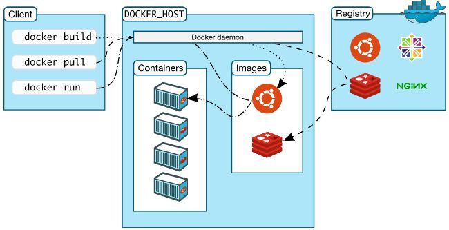

# learn docker 
[Docker官网](https://www.docker.com)

[Docker Hub](https://hub.docker.com)


## 1. 安装docker
### 1.1 linux服务器安装
```sh
# yum centos工具包 类似于 npm
yum install -y yum-utils device-mapper-persistent-data lvm2
# 添加一个阿里的源
yum-config-manager \
    --add-repo \
    https://mirrors.aliyun.com/docker-ce/linux/centos/docker-ce.repo
# 安装docker ce社区版免费  ee企业版收费
yum install -y docker-ce docker-ce-cli containerd.io
```
### 1.2 mac安装
- https://www.docker.com/products/docker-desktop

## 2. docker安装软件加速
### 2.1 linux服务器安装
```sh
# 创建文件夹
mkdir -p /etc/docker
# 将内容写入
tee /etc/docker/daemon.json <<-'EOF'
{
  "registry-mirrors": ["https://xx.mirror.aliyuncs.com"]
}
EOF
# 重载所有修改过的配置文件
systemctl daemon-reload
systemctl restart docker
```

## 3. 常用命令

### 3.1 容器信息
```sh
# 查看docker容器版本
docker version
# 查看docker容器信息
docker info
#查看docker容器帮助
docker --help
```

### 3.2 镜像操作

命令 | 含义 | 语法 |
- | :-: | :-: | :-: | -:
ls | 查看全部镜像 | docker image ls / docker images
search | 查找镜像 | docker search [imageName]
history | 查看镜像历史 | docker history [imageName]
inspect | 显示一个或多个镜像详细信息 | docker inspect [imageName]
pull | 拉取镜像 | docker pull [imageName]
push | 推送一个镜像到镜像仓库 | docker push [imageName]
rmi | 删除镜像 | docker rmi [imageName]/docker image rmi 2


### 3.3 容器操作


